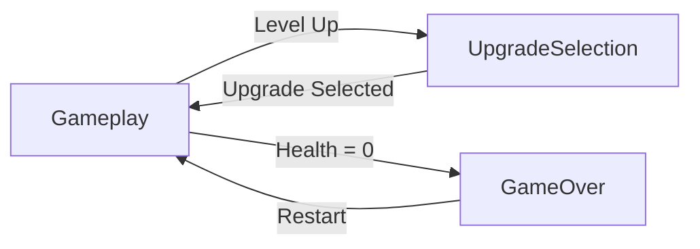

# Rhythm Vampire Survivors - Technical Architecture Plan

## Project Overview
A rhythm-based Vampire Survivors clone where all movement and actions are synchronized to the beat of music. Players move freely (not grid-based) but only on specific beats, creating a unique tactical rhythm gameplay experience.

## Core Systems Architecture

### 1. Beat/Rhythm System

#### BeatManager (Singleton)
**Purpose**: Central timing system that synchronizes all game actions to music beats.

**Key Responsibilities**:
- Calculate beat timing based on configurable BPM
- Emit beat events for other systems to subscribe to
- Track current beat number and measure
- Provide timing windows for "on-beat" actions
- Handle beat visualization feedback

**Key Properties**:
```csharp
- float BPM (from ScriptableObject)
- float SecondPerBeat (calculated)
- int CurrentBeat
- float BeatProgress (0-1 within current beat)
- UnityEvent OnBeat
- UnityEvent<int> OnBeatNumber (for specific beat intervals)
```

**Implementation Notes**:
- Uses Time.time for precise timing
- Accounts for audio latency if needed
- Provides methods like `IsOnBeat(float tolerance)` for timing checks
- Integrates with AudioManager for music playback

---

### 2. ScriptableObject Architecture

#### GameConfigSO
**Purpose**: Global game settings
```csharp
- float BPM (default: 120)
- float BeatTolerance (for input timing)
- int StartingPlayerHealth
- float SpawnRadius (distance from player)
```

#### StageConfigSO
**Purpose**: Per-level configuration
```csharp
- int StageNumber
- EnemySpawnData[] EnemySpawns (type + count)
- AttackUpgradeSO[] AvailableUpgrades
- AttackTypeSO[] AvailableNewAttacks
- int ExperienceToNextLevel
- float EnemySpawnInterval (in beats)
```

#### EnemyTypeSO
**Purpose**: Enemy behavior and stats
```csharp
- string EnemyName
- GameObject Prefab
- float MoveDistance (units per move)
- int BeatsToMove (frequency of movement)
- float CollisionDamage
- int ExperienceValue
- EnemyBehaviorType BehaviorType (enum: Chase, Stationary, Ranged)
- ProjectileTypeSO ProjectileType (if ranged)
- int BeatsToShoot (for ranged enemies)
```

#### AttackTypeSO (Base)
**Purpose**: Base class for all attack types
```csharp
- string AttackName
- Sprite Icon
- GameObject VisualPrefab
- int BeatsToSpawn (spawn frequency)
- float Damage
- AttackCategory Category (enum: Projectile, Beam, Shield, Bomb, AutoAttacker)
```

#### ProjectileAttackSO : AttackTypeSO
```csharp
- float MoveDistance (per move)
- float BeatsToMove (movement frequency)
- bool DestroyOnHit
- int MaxPierceCount
```

#### AttackUpgradeSO
**Purpose**: Upgrade definitions
```csharp
- string UpgradeName
- Sprite Icon
- string Description
- AttackTypeSO TargetAttack
- UpgradeType Type (enum: Damage, Speed, Range, Special)
- float ValueModifier
```

---

### 3. Player System

#### PlayerController
**Purpose**: Handle player movement and input

**Key Responsibilities**:
- Read input direction from Input System (Mouse position or WASD)
- Store last input direction
- Move on specific beats (configurable, default every 2 beats)
- Trigger movement animation
- Handle collision with enemies and collectibles

**Movement Logic**:
```
1. Every frame: Read input and store direction vector
2. On designated beat: Move by fixed distance in stored direction
3. Trigger jump/rotation animation via DOTween
4. Stand still between beats
```

**Key Properties**:
```csharp
- InputActionReference MoveAction
- float MoveDistance (1 unit default)
- int BeatsPerMove (2 beats default)
- float CurrentHealth
- int CurrentLevel
- int CurrentExperience
```

#### PlayerHealth
**Purpose**: Manage player health and damage

**Key Responsibilities**:
- Track current health
- Handle damage events
- Trigger invincibility frames
- Emit death event
- Visual feedback on damage

#### PlayerAnimator
**Purpose**: Handle player visual feedback

**Key Responsibilities**:
- Jump animation on movement (DOTween)
- Rotation animation (90° on local X-axis per beat)
- Damage flash effect
- Scale pulse on beat

---

### 4. Enemy System

#### Enemy (Base Class)
**Purpose**: Base enemy behavior

**Key Responsibilities**:
- Subscribe to beat events
- Execute movement on designated beats
- Handle collision with player
- Handle damage and death
- Drop experience gem on death

**Key Properties**:
```csharp
- EnemyTypeSO EnemyData
- Transform Target (player)
- int BeatCounter
- float CurrentHealth
```

**Movement Logic**:
```
1. On beat event: Increment beat counter
2. If (beatCounter % BeatsToMove == 0):
   - Calculate direction to player
   - Move by MoveDistance in that direction
   - Check for collisions with other enemies (maintain spacing)
   - Trigger movement animation
```

#### EnemyChaser : Enemy
**Purpose**: Standard enemy that chases player

#### EnemyStationary : Enemy
**Purpose**: Enemy that doesn't move (obstacle)

#### EnemyRanged : Enemy
**Purpose**: Enemy that shoots projectiles

**Additional Responsibilities**:
- Track shooting beat counter
- Spawn projectile on designated beats
- Aim at player position at spawn time

---

### 5. Attack System

#### AttackManager
**Purpose**: Manage all active player attacks

**Key Responsibilities**:
- Track equipped attacks
- Spawn attacks on designated beats
- Handle attack upgrades
- Manage attack instances

**Key Properties**:
```csharp
- List<AttackInstance> ActiveAttacks
- Transform Player (for spawn position)
```

#### AttackInstance (Base Class)
**Purpose**: Runtime instance of an attack

**Key Responsibilities**:
- Subscribe to beat events
- Execute attack behavior on beats
- Handle collision detection
- Visual effects

**Derived Classes**:
- **ProjectileAttack**: Moves in direction, damages on hit
- **BeamAttack**: Continuous damage in direction
- **ShieldAttack**: Orbits player, damages on contact
- **BombAttack**: Explodes after X beats, area damage
- **AutoAttackerAttack**: Stationary turret that shoots

---

### 6. Spawning System

#### EnemySpawner
**Purpose**: Spawn enemies based on stage configuration

**Key Responsibilities**:
- Read current StageConfigSO
- Spawn enemies at intervals (in beats)
- Calculate spawn positions (circle around player)
- Ensure enemies don't spawn too close to player
- Track alive enemy count

**Spawn Logic**:
```
1. On designated beat:
   - Check if more enemies needed
   - Calculate random angle around player
   - Calculate position at SpawnRadius distance
   - Instantiate enemy prefab
   - Initialize enemy with target (player)
```

#### CollectibleSpawner
**Purpose**: Spawn experience gems when enemies die

**Key Responsibilities**:
- Listen to enemy death events
- Spawn gem at enemy position
- Handle gem collection by player

---

### 7. Game State Management

#### GameStateManager (Singleton)
**Purpose**: Manage game phases and state transitions

**States**:
- **Gameplay** (Phase A): Active combat
- **UpgradeSelection** (Phase B): Paused, showing upgrade options
- **GameOver**: Player died
- **Victory**: Stage completed (optional)

**Key Responsibilities**:
- Track current state
- Handle state transitions
- Pause/unpause game
- Emit state change events

**State Transitions**:


#### LevelManager
**Purpose**: Track player progression

**Key Responsibilities**:
- Track current level
- Track experience
- Load appropriate StageConfigSO
- Trigger level up when experience threshold reached
- Emit level up event

---

### 8. UI System

#### HUDManager
**Purpose**: Display gameplay information

**Elements**:
- Health bar
- Experience bar
- Current level
- Current stage/wave
- Active attacks icons

#### UpgradeScreenUI
**Purpose**: Display upgrade options

**Key Responsibilities**:
- Show 3 random upgrade/attack options
- Handle player selection
- Display upgrade details (icon, name, description)
- Pause game during display

**Selection Logic**:
```
1. Get available upgrades from current StageConfigSO
2. Get available new attacks from current StageConfigSO
3. Randomly select 3 options (mix of upgrades and new attacks)
4. Display in UI cards
5. On selection: Apply upgrade/add attack, resume game
```

#### GameOverUI
**Purpose**: Display game over screen

**Elements**:
- Final score/level reached
- Restart button
- Quit button

#### BeatFeedbackUI
**Purpose**: Visual beat indicator

**Key Responsibilities**:
- Pulse screen overlay on each beat
- Subtle vignette flash
- Optional: Screen shake on strong beats

---

### 9. Camera System

#### CameraController
**Purpose**: Follow player smoothly

**Key Responsibilities**:
- Follow player X and Z position
- Maintain fixed Y position and rotation
- Smooth damping for movement
- Optional: Slight camera shake on damage

**Implementation**:
```csharp
void LateUpdate() {
    Vector3 targetPos = new Vector3(
        player.position.x,
        fixedHeight,
        player.position.z
    );
    transform.position = Vector3.Lerp(
        transform.position,
        targetPos,
        smoothSpeed * Time.deltaTime
    );
}
```

---

### 10. Visual Feedback System

#### FeedbackManager
**Purpose**: Centralize visual and audio feedback

**Key Responsibilities**:
- Screen flash on beat
- Damage feedback (screen shake, color flash)
- Hit effects (particles, sound)
- Level up effects
- Death effects

**Integration with DOTween**:
- Screen pulse: Scale UI overlay
- Damage flash: Color tween on screen overlay
- Hit effects: Scale and fade particles
- Player movement: Jump and rotation tweens

---

## Implementation Challenges & Solutions

### Challenge 1: Enemy Collision Avoidance
**Problem**: Enemies moving simultaneously might overlap

**Solution**:
- Use Physics.OverlapSphere before moving
- If collision detected, try alternative positions (slight angle offset)
- If no valid position, skip movement this beat
- Maintain minimum distance between enemies

### Challenge 2: Beat Synchronization Accuracy
**Problem**: Ensuring all systems stay synchronized to beat

**Solution**:
- Single source of truth: BeatManager
- All systems subscribe to OnBeat event
- Use beat counter for interval-based actions
- Avoid using Time.deltaTime for beat-based logic

### Challenge 3: Projectile Collision with Moving Targets
**Problem**: Projectiles and enemies both move on beats

**Solution**:
- Check collisions immediately after movement
- Use trigger colliders for continuous detection
- Projectiles check for hits after each move
- Enemies check for player collision after each move

### Challenge 4: Upgrade System Flexibility
**Problem**: Different upgrades affect different properties

**Solution**:
- Use Strategy pattern for upgrade application
- Each upgrade type has Apply() method
- Upgrades modify AttackInstance properties
- Support stacking upgrades (track upgrade level)

---

## File Structure

```
Assets/
├── Scripts/
│   ├── Core/
│   │   ├── BeatManager.cs
│   │   ├── GameStateManager.cs
│   │   └── LevelManager.cs
│   ├── Player/
│   │   ├── PlayerController.cs
│   │   ├── PlayerHealth.cs
│   │   └── PlayerAnimator.cs
│   ├── Enemies/
│   │   ├── Enemy.cs (base)
│   │   ├── EnemyChaser.cs
│   │   ├── EnemyStationary.cs
│   │   └── EnemyRanged.cs
│   ├── Attacks/
│   │   ├── AttackManager.cs
│   │   ├── AttackInstance.cs (base)
│   │   ├── ProjectileAttack.cs
│   │   ├── BeamAttack.cs
│   │   ├── ShieldAttack.cs
│   │   ├── BombAttack.cs
│   │   └── AutoAttackerAttack.cs
│   ├── Spawning/
│   │   ├── EnemySpawner.cs
│   │   └── CollectibleSpawner.cs
│   ├── UI/
│   │   ├── HUDManager.cs
│   │   ├── UpgradeScreenUI.cs
│   │   ├── GameOverUI.cs
│   │   └── BeatFeedbackUI.cs
│   ├── Camera/
│   │   └── CameraController.cs
│   ├── Feedback/
│   │   └── FeedbackManager.cs
│   └── Editor/
│       └── GameSetupEditor.cs (generates scene)
├── ScriptableObjects/
│   ├── Config/
│   │   └── GameConfigSO.cs
│   ├── Stages/
│   │   └── StageConfigSO.cs
│   ├── Enemies/
│   │   └── EnemyTypeSO.cs
│   └── Attacks/
│       ├── AttackTypeSO.cs (base)
│       ├── ProjectileAttackSO.cs
│       └── AttackUpgradeSO.cs
├── Prefabs/
│   ├── Player.prefab
│   ├── Enemies/
│   ├── Attacks/
│   └── Collectibles/
├── Resources/
│   ├── GameConfig.asset
│   ├── Stages/
│   ├── Enemies/
│   └── Attacks/
└── Scenes/
    └── GameScene.unity
```

---

## Editor Script Requirements

The [`GameSetupEditor.cs`](Assets/Scripts/Editor/GameSetupEditor.cs) script should create:

### Scene Objects
1. **GameManager** (empty GameObject)
   - BeatManager component
   - GameStateManager component
   - LevelManager component
   - EnemySpawner component
   - CollectibleSpawner component
   - AttackManager component
   - FeedbackManager component

2. **Player** (Cube)
   - PlayerController component
   - PlayerHealth component
   - PlayerAnimator component
   - Rigidbody (kinematic)
   - Capsule Collider

3. **Main Camera**
   - CameraController component
   - Position: (0, 10, -5)
   - Rotation: (45, 0, 0)

4. **Ground Plane**
   - Large plane for visual reference
   - Position: (0, 0, 0)

### UI Canvas
1. **HUD Canvas** (Screen Space Overlay)
   - Health Bar
   - Experience Bar
   - Level Display
   - Active Attacks Panel
   - Beat Feedback Overlay (full screen image)

2. **Upgrade Screen Canvas** (initially disabled)
   - Background overlay (semi-transparent)
   - 3 Upgrade Cards (buttons with icon, name, description)
   - Title text

3. **Game Over Canvas** (initially disabled)
   - Game Over text
   - Final Score display
   - Restart button
   - Quit button

### Prefabs to Create
1. **Player Prefab** (3D Cube with materials)
2. **Enemy Prefabs** (different colored cubes)
3. **Projectile Prefab** (small sphere)
4. **Experience Gem Prefab** (small rotating crystal/sphere)

### ScriptableObject Assets
1. **GameConfig** (default settings)
2. **Stage Configs** (Stage 1-5 with increasing difficulty)
3. **Enemy Types** (Chaser, Stationary, Ranged)
4. **Attack Types** (Projectile, Beam, Shield, Bomb, AutoAttacker)
5. **Upgrades** (various upgrade options)

---

## Key Design Patterns

1. **Singleton**: BeatManager, GameStateManager
2. **Observer**: Beat events, state change events
3. **Strategy**: Upgrade application, enemy behaviors
4. **Object Pool**: Projectiles, enemies, effects (optional optimization)
5. **ScriptableObject Architecture**: Data-driven design

---

## Integration with Existing Systems

### Input System
- Create InputActions asset with "Move" action (Vector2)
- Use InputActionReference in PlayerController
- Support both mouse position and WASD/gamepad

### DOTween
- Player jump animation: `transform.DOJump()`
- Player rotation: `transform.DOLocalRotate()`
- UI pulse: `transform.DOScale()`
- Screen flash: `image.DOColor()`
- Damage feedback: `transform.DOShakePosition()`

### AudioManager (FMOD)
- Play music track on game start
- Sync BeatManager with music BPM
- Play hit sounds on damage
- Play level up sound
- Play attack sounds

---

## Testing & Balancing Considerations

1. **Beat Timing**: Ensure all actions feel responsive and synchronized
2. **Movement Speed**: Balance move distance with beat frequency
3. **Enemy Difficulty**: Scale enemy count and types per stage
4. **Upgrade Power**: Ensure upgrades feel impactful but not overpowered
5. **Visual Clarity**: Ensure player can track all moving elements
6. **Performance**: Monitor with many enemies and projectiles active

---

## Next Steps

Once this plan is approved, the implementation will proceed in this order:

1. ✅ Core rhythm system (BeatManager)
2. ✅ ScriptableObject architecture
3. ✅ Player controller with beat-synchronized movement
4. ✅ Enemy system with basic chaser behavior
5. ✅ Basic projectile attack system
6. ✅ Spawning systems
7. ✅ Game state management
8. ✅ UI systems
9. ✅ Visual feedback and animations
10. ✅ Editor script for scene generation
11. ✅ Additional attack types and upgrades
12. ✅ Polish and balancing

---

## Notes

- All movement is **free-form** (not grid-based) but **beat-synchronized**
- Movement only occurs on specific beats, with pauses in between
- Player moves in the direction of mouse/input every X beats
- Enemies move toward player every Y beats
- Projectiles move in their direction every Z beats
- Everything stands still between beats, creating rhythmic gameplay
- BPM is configurable via ScriptableObject (default: 120 BPM)
- Visual beat feedback via subtle screen pulse/flash
- Enemies spawn in circle around player at configurable radius
