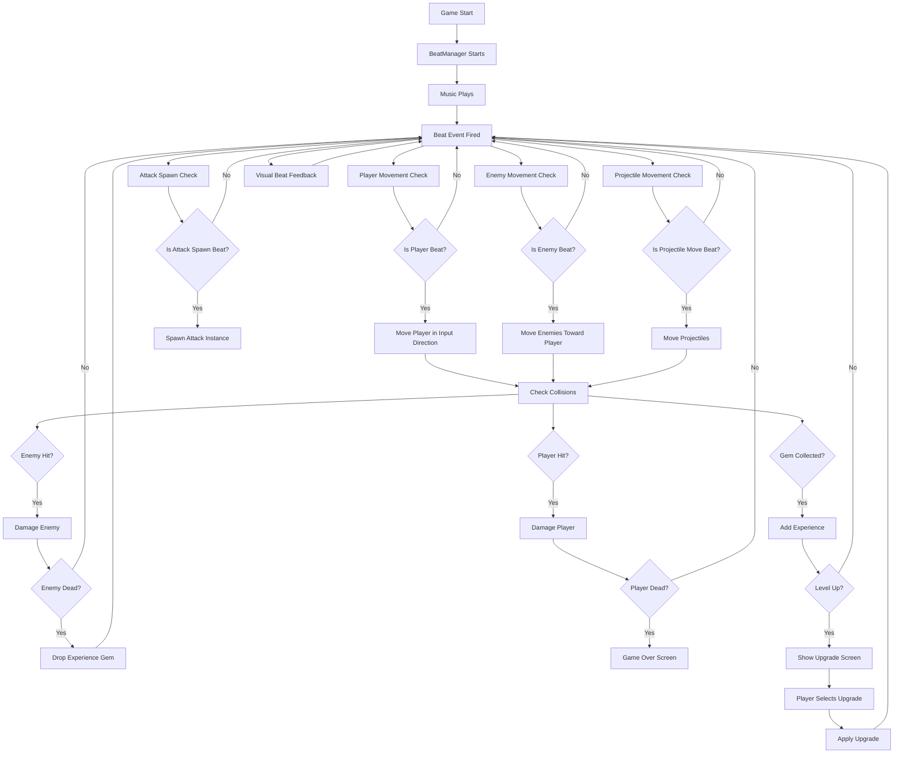
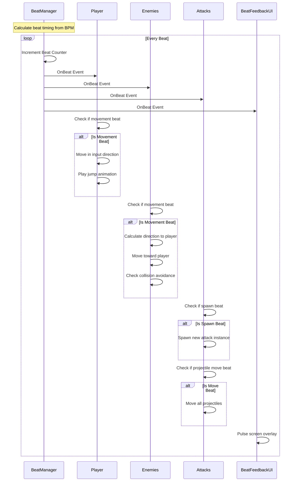
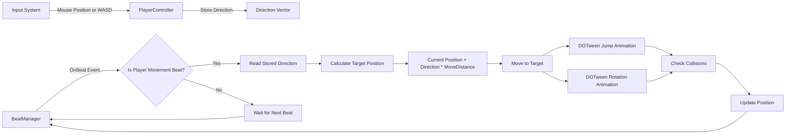
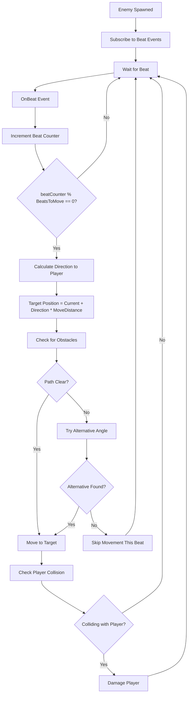
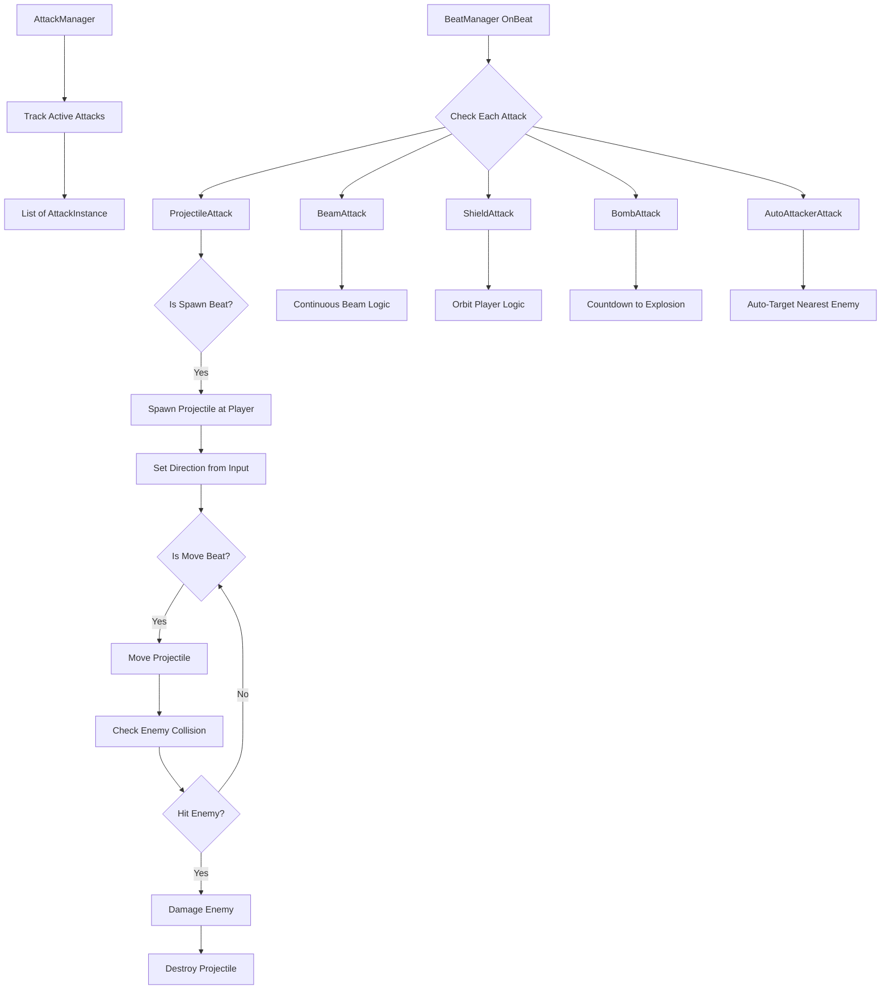
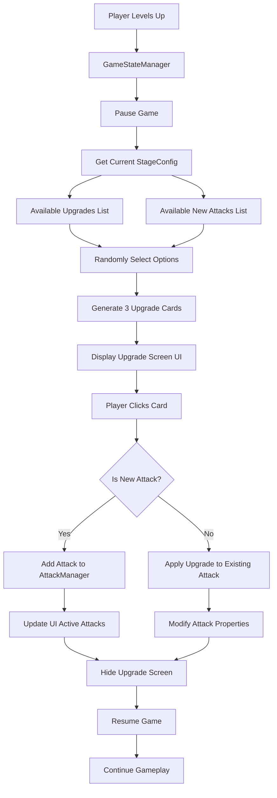
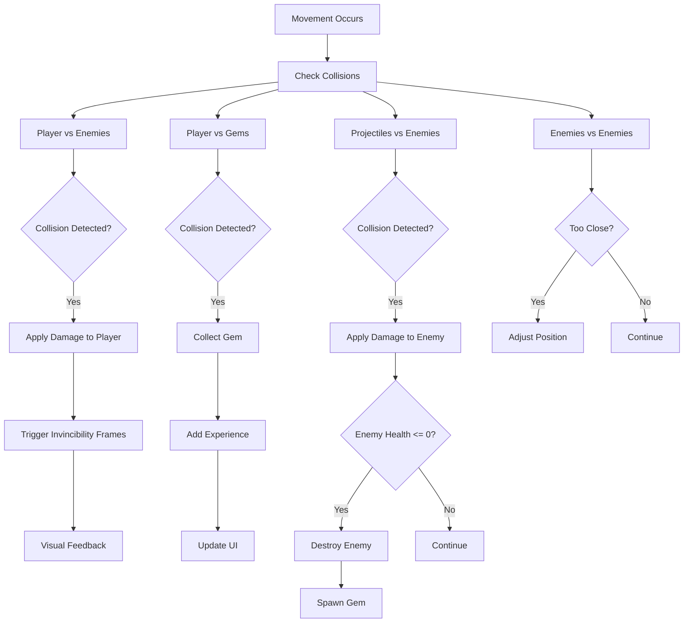
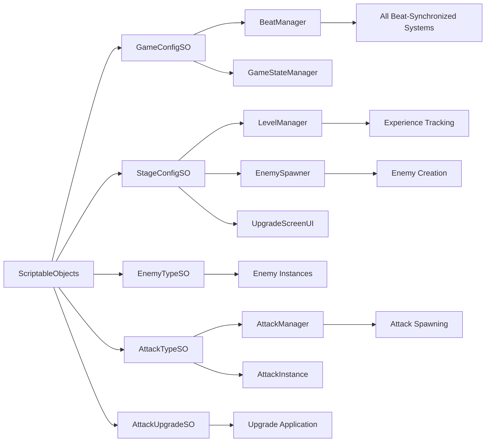
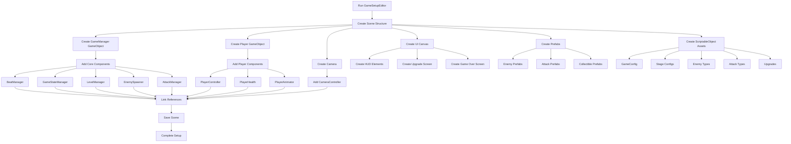

# System Interactions Diagram

## Core Game Loop Flow

## Beat Synchronization System

## Player Input and Movement Flow

## Enemy Behavior System

## Attack System Architecture

## Upgrade System Flow

## Collision Detection System

## Data Flow Architecture

## Editor Script Generation Flow

